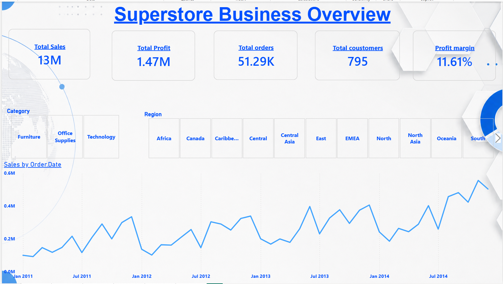
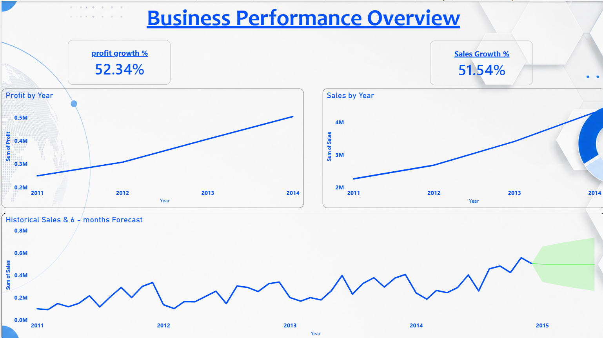
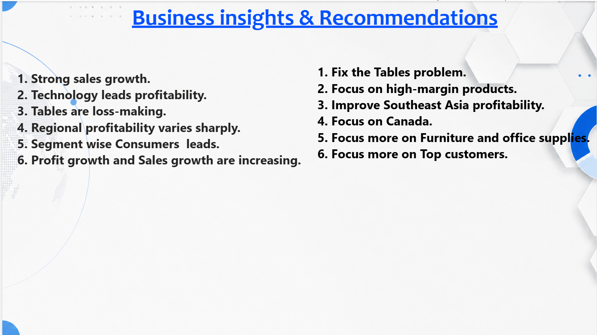

# Global Superstore Sales Analysis

## 📊 Project Overview

This project presents an end-to-end analysis of the Global Superstore dataset using SQL and Microsoft Power BI.

The analysis focuses on sales, profit, customers, products, geographical performance, discounts, order trends, and business performance.

SQL was used for data exploration, analysis, aggregations, window functions, views, joins, and business-focused queries. Power BI was used to transform the analysis into an interactive dashboard.

---

## 🎯 Project Objectives

- Analyze overall sales and profit performance
- Identify top-performing categories and sub-categories
- Analyze customer and segment performance
- Evaluate geographical sales and profitability
- Understand the impact of discounts on profit
- Analyze sales and profit trends over time
- Identify top customers and products
- Identify profitable and loss-making areas
- Generate actionable business insights

---

## 🛠️ Tools & Technologies

- **SQL** – Data exploration, analysis, aggregation, joins, views and advanced queries
- **Microsoft Power BI** – Interactive dashboard and data visualization
- **Power Query** – Data transformation
- **DAX** – Dashboard calculations and measures


---

## 📊 Dashboard Preview

## 📊 Dashboard Preview







Screenshots/Global_Superstore_Dashboard  1.png

---


## 💡 Key Business Insights

- Technology is one of the strongest profitability contributors.
- Profitability varies significantly across geographical regions.
- Some sub-categories generate losses despite contributing to overall sales.
- Consumer is the leading customer segment based on the analysis.
- Sales and profit show an overall positive growth trend.
- Certain regions require additional profitability improvement.
- Discount levels should be monitored because higher discounts can affect profitability.
- Top customers represent important contributors to overall business performance.

---

## 💼 Business Recommendations

- Focus on high-performing and profitable product categories.
- Review loss-making sub-categories and identify their cost drivers.
- Monitor discount strategies to protect profit margins.
- Strengthen performance in underperforming geographical markets.
- Develop strategies to retain high-value customers.
- Analyze regional profitability before increasing sales investment.
- Prioritize products and markets that provide strong sales and profit together.

---

## 📁 Project Structure

```text
Global-Superstore-Sales-Analysis/
│
├── README.md
│
├── PowerBI/
│   └── Global_Superstore_Dashboard.pbix
│
├── SQL/
│   └── Global_Superstore_Analysis.sql
│
├── Data/
│   └── Global_Superstore.csv
│
└── Screenshots/
    └── Global_Superstore_Dashboard.png
